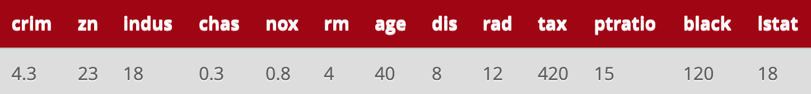

```{r}
library(MASS)
library(tree)
library(parallel)
```

# Introduction
1. In your own words, describe briefly the data sets and the practical problems that are associated with them.

For regression, a dataset of home values in Boston, Massachusetts USA which includes demographic information is used. Of note is the age of the dataset - the original source was published in the 1970's, so home prices are much lower than one would expect from a modern dataset, due to the influence of decades of inflation.

For classification, 16x16 grayscale images of handwritten digits are used to classify into their appropriate number. Classification of this dataset is known to be difficult, with a 2.5% error rate being considered excellent performance.

# Regression Trees
2. Fit an unpruned regression tree (using mindev=0.005) to the Boston data and plot it (as clearly as you can, by adjusting the dimension of the diagram in your R Markdown file).

```{r}
summary(Boston)
```

```{r fig.height=8, fig.width=10}
reg <- tree(medv ~ ., data=Boston, mindev=0.005)
plot(reg)
text(reg, pretty=0)
```

Identify the four most important splits in the unpruned tree, and explain why they are.

```{r}
top4inds <- rev(order(reg$frame$dev))[1:4]
as.matrix(reg$frame[top4inds, c(1,5)])
```

The four most important splits in the unpruned tree are:

- rm < 6.941
- lstat < 14.4
- dis < 1.38485
- rm < 7.437

Their relative importance can also be identified in the dendrogram by locating the longest vertical distances after split. They are most important because they reduce the variation (or deviance) in the resulting subsets; After each of those splits, the separated subsets are much more self-similar than the single set where they were unified.

3. Find the solutions to the following questions from the unpruned tree (without using code).

```{r}
reg
```

i. What is the variation (TSS) reduction by the split at the root node?

- The variation reduction by the first split rm < 6.941 is difference in deviance of the unified dataset with the sum of deviances of resulting datasets after split. This is given by 42720 - (17320 + 6059) = 19341.

ii. What is the predicted response value by the tree for the following observation?



By following the tree's prescribed splits on this observation, we can derive the predicted value. The tree sends the observation to the:

- left at node 2, as `4 < 6.941`
- right at node 5, as `18 > 14.4`
- left at node 10, as `4.3 < 6.99237`
- right at node 21, as `0.8 > 0.531`

This lands the observation in leaf node 21 which predicts a `medv` median home value of 16.24 (in 1,000's USD).

iii. In which hyper-rectangular “region”, the median value of owner-occupied homes is the highest?

- Of all possible median home prices predicted by the model, 46.82 is highest, at node 14. This node is associated with the hyper-rectanglar region where `rm > 6.941`, `rm > 7.437`, and `ptratio < 17.9`.

4. Find the best pruned tree of size 5.

Does this tree contain the most important splits you chose earlier? Describe when the best pruned tree of size k must contain the (k-1) most important splits. Provide your reasoning.

```{r}
(best5 <- prune.tree(reg, best=5))
```

- This tree does contain the most important splits from the unpruned tree. Maintaining the k-1 most important splits in a tree of size k should always hold true if the tree is pruned based on size. It is possible that pruning using cost-complexity would yield different splits, however.

5. Find the pruned tree, based on 10-fold cross-validation (just 1 repetition), and plot it (as clearly as you can).

```{r fig.height=8, fig.width=10}
set.seed(123)
cv.reg <- cv.tree(reg, K=10)
(bestK <- cv.reg$size[which.min(cv.reg$dev)])
best.reg <- prune.tree(reg, best=bestK)
plot(best.reg)
text(best.reg, pretty=0)
```


# Classification trees
For the problems below that concern classification, use the two USPS data sets. Make sure that the response variable digit is a factor. An error mentioned below means a misclassification rate.

```{r}
ziptrain <- read.csv("ziptrain.csv")
ziptrain$digit <- as.factor(ziptrain$digit)

ziptest <- read.csv("ziptest.csv")
ziptest$digit <- as.factor(ziptest$digit)
```

6. Grow an unpruned tree that fits the training data perfectly. (No need to plot it, as it may be quite large).

Consider pruning this tree using the cost-complexity criterion in terms of deviance/entropy. Find the (training) deviance values of all the trees in the sequence of nested trees. Must these values be monotone with the size of the tree? Explain why.


```{r}
c <- tree(digit ~ ., data=ziptrain, mindev=0.001)
p <- prune.tree(c, method="deviance")
p$dev
cat("Monotonic:", all(seq_along(p$dev) == order(p$dev)))
```

- The deviance of each successively pruned tree is always monotonic with respect to the training data. The cost-complexity criterion, for fixed k, is linear with respect to the size of the tree, so each reduction in tree size must reduce the complexity. This necessarily increases the deviance of the resulting tree with respect to the training data, as the model is not able to fit as tightly, but it is hoped to reduce the deviance with respect to the test data.

7. Consider pruning the unpruned tree obtained in Question 6, using the cost-complexity criterion in terms of deviance.

Find both the training and test errors of all the nested trees in the sequence. Show both error curves versus the size of the tree in one graph.

(There is a small bug in prune.tree(). When the tree size is 1, it returns an object of class singlenode, rather than an object of class tree, and thus predict.tree() cannot be used in this case. A simple solution is to set the output of prune.tree() when the tree size is 1 to class tree, by using the class function.)

```{r}
prediction <- function(tree, data, size) {
    pruned <- prune.tree(tree, best=size)
    if (class(pruned) != "tree") class(pruned) <- "tree"
    predict(pruned, data, type="class")
}
```

```{r}
trainErrs <- sapply(p$size, function(x) {mean(prediction(c, ziptrain, x) != ziptrain$digit)})
```

```{r}
testErrs <- sapply(p$size, function(x) {mean(prediction(c, ziptest, x) != ziptest$digit)})
```

```{r}
m <- cbind(testErrs, trainErrs)
matplot(x=p$size, y=m, type='l', lty=1, xlab="Pruned Tree Size",
        ylab="Misclassification Error")
legend("topright", legend=c("test","train"), col=1:2, lty=1)
```

8. Consider pruning the tree using 10-fold cross-validation with 20 repetitions (in aid of parallel computing using 20 cores) for the purpose of minimising the deviance. What are the training and test errors of the resulting (smallest) pruned tree?

```{r}
mc.cv <- function(seed, ...) {
    set.seed(seed)
    cv.c <- cv.tree(c, ...)
    # reverse size and dev to get smallest tree of those with min dev
    best <- rev(cv.c$size)[which.min(rev(cv.c$dev))]
    trainerr <- mean(prediction(c, ziptrain, best) != ziptrain$digit)
    testerr <- mean(prediction(c, ziptest, best) != ziptest$digit)
    c(best, trainerr, testerr)
}

get_best <- function(method, reps=20) {
    cv.dev <- matrix(unlist(mclapply(X=1:reps*reps, FUN=mc.cv, 
                                     method=method, mc.cores=20)),
                     ncol=3, byrow=T)
    colnames(cv.dev) <- c("size", "train_err", "test_err")
    lowest_err <- cv.dev[cv.dev[,3] == min(cv.dev[,3]),]
    if (class(lowest_err)[1] == "numeric") lowest_err
    else lowest_err[which.min(lowest_err[,1]),]
}

get_best(method="deviance")
```


9. Consider pruning the tree using 10-fold cross-validation with 20 repetitions (in aid of parallel computing using 20 cores) for the purpose of minimising the misclassification rate. What are the training and test errors of the resulting (smallest) pruned tree?

```{r}
get_best(method="misclass")
```


# Summary

In this report, regression and classification trees are used to predict home prices and handwritten digits, respectively. The tradeoffs of pruning methods are explored, and parallelised cross-validation is used to choose a model which both minimises prediction error and model size. 


